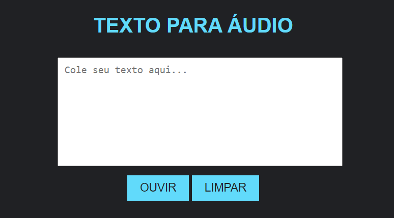

# VOZ DO NARRADOR
🌚CONVERTA SEU TEXTO PARA AUDIO!

  

## DESCRIÇÃO:
Este projeto proporciona uma maneira simples de converter texto em áudio. Aqui estão as principais funcionalidades implementadas:

1. **Converter Texto em Áudio:**
   - Permite ao usuário inserir texto no campo de entrada.
   - Ao clicar em "OUVIR", o texto inserido é convertido em fala e reproduzido pelo dispositivo.

2. **Verificação de Texto:**
   - Antes de converter em áudio, o projeto verifica se há texto no campo de entrada.
   - Se o campo estiver vazio, uma mensagem de alerta é exibida pedindo para o usuário inserir um texto.

3. **Controle de Reprodução:**
   - Se houver um texto sendo falado atualmente, clicar em "OUVIR" novamente cancelará a reprodução anterior e iniciará a nova.
   - O botão "LIMPAR" permite ao usuário limpar o campo de texto e cancelar a reprodução atual, se houver.

## EXECUTANDO O PROJETO:
1. **Inserir Texto:**
   - Cole ou digite o texto que deseja converter em áudio no campo de entrada.

2. **Ouvir Texto Convertido:**
   - Clique no botão "OUVIR" para ouvir o texto convertido em áudio.

3. **Cancelar Reprodução:**
   - Se desejar interromper a reprodução antes de sua conclusão, clique novamente em "OUVIR".
   - Para limpar o campo de texto e cancelar a reprodução atual, clique em "LIMPAR".

## NÃO SABE?
- Entendemos que para manipular arquivos em `HTML`, `CSS` e outras linguagens relacionadas, é necessário possuir conhecimento nessas áreas. Para auxiliar nesse aprendizado, oferecemos cursos gratuitos disponíveis:
* [CURSO DE HTML E CSS](https://github.com/VILHALVA/CURSO-DE-HTML-E-CSS)
* [CURSO DE JAVASCRIPT](https://github.com/VILHALVA/CURSO-DE-JAVASCRIPT)
* [CONFIRA MAIS CURSOS](https://github.com/VILHALVA?tab=repositories&q=+topic:CURSO)

## CREDITOS:
- [PROJETO CRIADO PELO VILHALVA](https://github.com/VILHALVA)
- [ESTÁ DISPONIVEL NO SITE](https://vilhalva.github.io/STYLER/STYLER.html)